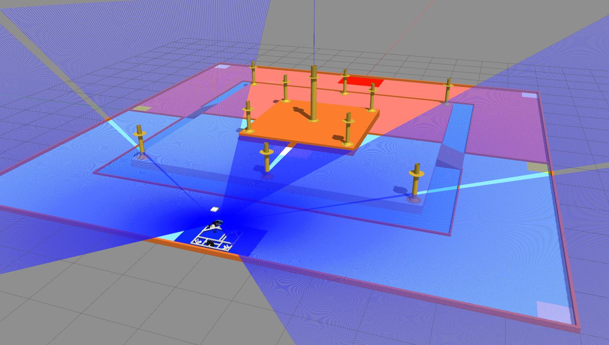

# robotbase

<p align="center">
  
</p>

To open the gazebo simulation
```
roslaunch robotbase sim_map.launch 
```
Can use joystick to control the robot 

  | Button | Description |
  | --- | --- |
  | `Up` | Robot go **+X** or go **Forward**|
  | `Down` | Robot go **-X** or go **Backward** |
  | `Right` | Robot go **-Y** or go **Right** |
  | `Down` | Robot go **+Y** or go **Left** |
  | `L1` | Robot heading go **+Z** |
  | `R1` | Robot heading go **-Z** |

  | Analog | Description |
  | --- | --- |
  | `X left analog` | Robot go **+-Y** |
  | `Y left analog` | Robot go **+-X** |
  | `X right analog` | Robot heading go **+-Z** |
